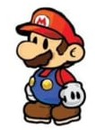

# 🎮 Mario Walking Animations

Welcome to the Mario Walking Animations repository! 🚶‍♂️✨

This project features a collection of **Mario walking animations** that showcase different movements of Mario walking left and right. These animations are inspired by various styles and portray Mario in different poses and angles.

Feel free to explore and use these animations for your own creative projects. Whether you're working on a game, animation, or just love Mario, these animations will add a touch of nostalgia and fun!

---

## 📂 Contents

- **Walking Animations**: A variety of Mario walking in different directions, with detailed poses and movements.
  
---

## 🔍 Preview Animations

Here are some of the walking animations included in the repository:

### 1. **Walking Left**  
     
   _A dynamic portrayal of Mario walking left with a confident stride._

### 2. **Walking Right**  
     
   _Mario in motion, heading to the right with his signature moves._

---

## 🚀 Usage

To incorporate these walking animations into your own projects:

1. Download the images from this repository.
2. Implement them into your games, animations, or websites.

You can modify the images to fit your specific project needs and add motion effects if required!

---

## 📜 License

These animations are inspired by Mario's original design but are not created by me. They are available for **personal and educational use** only. 

Please do **not** redistribute them for commercial use without appropriate authorization.

---

## 🙏 Credits

- Thanks to the original creators and artists who made Mario the iconic character he is today.
- Special thanks to the community for sharing resources that inspired this collection.

---

**Enjoy the animations, and happy coding!** 🎮💥
